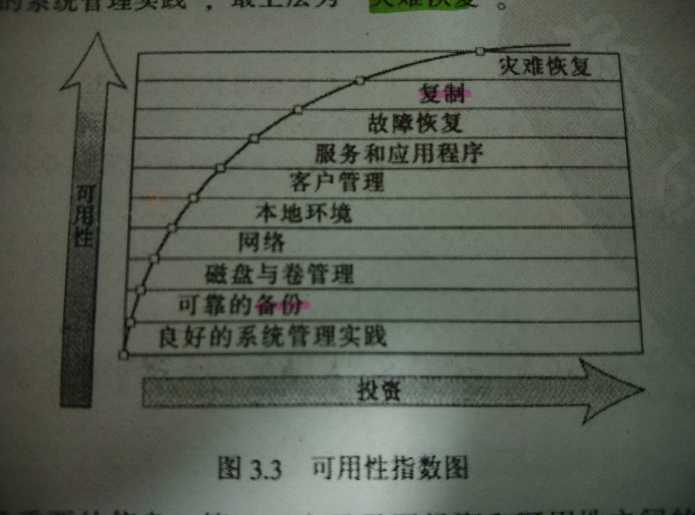

# 目录

1. [用例分析](#提出问题)
1. [架构设计](#架构设计)
1. [技术方案](#技术方案)
1. [参考产品](#参考系统)

# 提出问题

分析在各种场景下，系统行为如何，会导致什么严重问题，如何应对？

## 基本的备份/恢复过程

### 备份/恢复的基本过程

- 备份
- 故障转移 failover
- 回切 (暂不支持)

<!--
几个问题：

- 源和目标的关系（本地/远程，同构/异构，同步复制/异步复制）？
- 源和目标之间采用什么网络进行通信？
- 备份执行引擎和备份策略是什么？
-->

目前，采用同构，基于快照的异步复制方式进行备份。假设源和目标站点之间是IP可达的。

先采用人工方式进行故障转移。故障转移到备用站点后，要能结合应用层需求进行恢复，尽量做到对应用层透明，允许一定的数据损失。

不支持回切，如进行故障转移后，备用站点成了主站点，如果源站点再次上线，不可再接收备份过来的数据。否则，会导致数据不一致的严重后果。

## 复制元数据和数据，做到对应用层完全透明

- 卷属性
- 精简配置
- 用户创建的快照（暂不同步）

## clone出的卷，能否打快照？

Q: 虚机系统盘，都是从镜像里clone而出，如何备份到备用系统里？

A: 先flat clone出来的卷，然后进行备份。

## 一致性卷组(Consistent Group)

在虚机挂载多个卷的情况下，需要保证多个卷的数据一致性，首先，对多个相关卷打快照，然后复制到远程站点。

## 支持复杂的系统架构

- 两地三中心

## CDP和多层数据保护和灾难恢复

灾备涉及到多个层面，包括存储层，应用层等，为了保障业务连续性，需要进行综合考虑。

## 存储层和应用层的数据一致性

如果虚机已切换到DR站点，而卷或一致性卷组还没有同步到DR站点，应该如何处理？

<!--




-->

![可用性指数图][1]

# 架构设计

设计原则:

- 明确表述接口，分离机制和策略，提高可组合性和可扩展性
- 构建可持续演进的系统, 分阶段实施，满足RPO和RTO规格
- 预料到不可预料的情况，任何情况下都不要损坏数据
- 最小化对性能的影响
- 自动化是关键

> 墨菲法则：凡是可能出错的事必定会出错。

<!--
- 分离策略和机制
-->

衡量指标：

- RPO (Recovery Point Object, 可以容忍的数据丢失量)
- RTO (从故障开始到恢复所需的时间, 是一个综合性指标)

备份五要素

- 源
- 目标
- 通路
- 引擎
- 策略

接口设计：

- 可以采用不同的网络传输工具(如rsync）
- 网络传输运行在不同的网络上
- 接收端可支持不同的存储后端

相关特性：

- 快照
- 精简配置
- 卷/快照扩展属性
- 一致性卷组
- 消重
- 压缩
- 加密

# 技术方案

一期实现目标(MVP: Minimum viable product)：

> 根据远程复制策略，复制选择的卷到远程DR站点，做到*快照级别*的可恢复性和业务连续性。

后期规划, 以CDP为目标，围绕RPO和RTO，优化各模块：

- 监控复制进度和状态
- 自动化Failover过程
- 优化网络传输，提高带宽利用率
- 实现提交日志，支持同步复制

## MVP: 实现的关键点

快照命名规则：__rr_snap_destid_xxx_timestamp

> 名字中要包含目标站点的ID信息. 对每个目标站点，都有一次初始化的过程(第一次快照的处理逻辑）

备份策略：

- YML配置文件 or 配置数据库，方便动态变化
- 启动pool或volume的开关

remote_copy_policy.yml

```yml
policy:
  pools:
    - pool01
    - pool02
  volumes:
    - volume01
    - volume02
```

进程结构：

- lich.rc
 * 发起RC
 * 查询RC状态
 * 异步回收快照
- lich.rcd
 * 接收数据，重建VOLUME

reload配置文件

### 预备工作

- 创建快照时，捕获快照元数据
- 对clone出来的卷，先flat后，才能创建snapshot
- 删除一个卷快照的过程中，无法打快照，加入错误处理逻辑

### 源站：远程复制快照

```python
def sync_volume():
    """
    prev_snap: previous snapshot
    curr_snap: current snapshot
    """
    while True:
        curr_snap = create_snapshot()
        for chunk in curr_snap.chunk_list():
	    sync_chunk_data(prev_snap, curr_snap, chunk)
        # 同步元数据
        curr_snap.sync_metadata()
        # 发送完成消息
        send_ack()

def sync_chunk_data(prev_snap, curr_snap, chunk):
    need_sync = False
    found = False
    with chunk.lock():
	found = curr_snap.find(chunk)
        if found:
            need_sync = True
        else:
            if prev_snap:
	        if prev_snap.find(chunk):
                    read_from_lun_to_temp()
                    need_sync = True
                else:
                    pass
            else:
                read_from_lun_to_temp()
                need_sync = True
    if need_sync:
        data = found?read_chunk_from_snapshot():read_chunk_from_temp()
        sync_data((found?1:0, data))
```

### 网络传输

- 断点续传
- 调节传输速度
- 压缩

可先用rsync/rsyncd实现原型。

### 目标站点：merge同步来的数据, 生成快照

根据传过来的数据，重建volume和snapshot：

- 0，data：数据在volume上
- 1，data：数据在snapshot上

根据快照生产卷

> 可选方案：如果DR站点，只维护最新快照生成的VOLUME，此步就不必要了。

### 管理RC状态

- RC可以组织成FSM的形式
- 没有完成的RC，不可用
- 发生故障，能及时发现并继续
- 记录RC进度(状态变化历史)
- 重启进程，可以继续没完成的RC任务

### 异步回收快照，保留最近N个

在回收快照的过程中，能否创建快照？

### 容错

#### 禁止master volume接收备份数据
#### 存储层和应用层的数据一致性

## 评估

# 参考系统

- HP 3PAR Remote Copy
- EMC RecoveryPoint
- VMWare VSAN
- CEPH
- 飞康


  [1]: ./images/availability.jpeg "availability.jpeg"